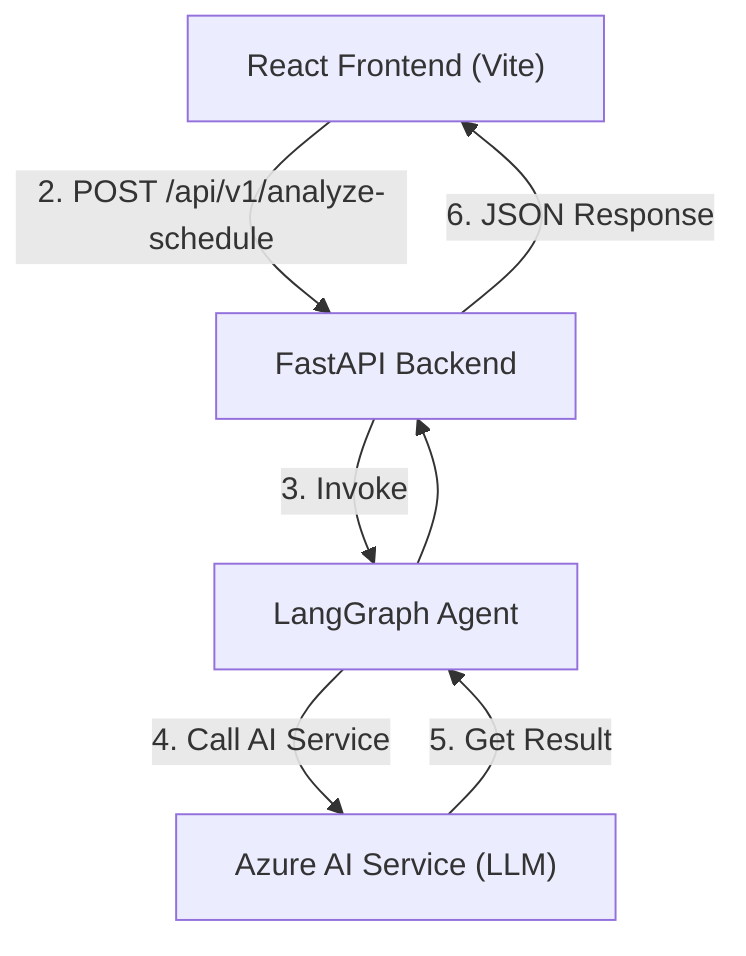

# AI-Powered Work-Life Balance Assistant

This repository contains the full-stack source code for the AI-Powered Work-Life Balance Assistant, an application designed to demonstrate the use of modern AI and web technologies to solve a real-world problem.

The project is inspired to help professionals improve their well-being and manage the complexities of modern work life.

## ► The Core Value: From Passive To-Do List to Proactive Assistant

A standard to-do list is a passive container; it will let you overload yourself without complaint. This application transforms that passive list into an intelligent, proactive assistant.

It analyzes your daily tasks to identify potential stress points, scheduling conflicts, and risks of burnout. It then provides objective, actionable suggestions to help you protect your time, energy, and long-term goals. The value is in outsourcing the cognitive load of daily planning and gaining a strategic overview of your day.

## ✨ Tech Stack & Architecture

This project is a decoupled, API-first application managed in a single monorepo.

| Category | Technology               |
| :------- | :----------------------- |
| Frontend | React, Vite, JavaScript  |
| Backend  | Python, FastAPI, Uvicorn |
| AI Layer | LangGraph, Azure AI      |
| DevOps   | Git, Docker (Future)     |

### System Architecture

The application consists of a React client that communicates with a FastAPI backend. The core AI logic is handled by a LangGraph agent, which orchestrates calls to the Azure AI Service.

